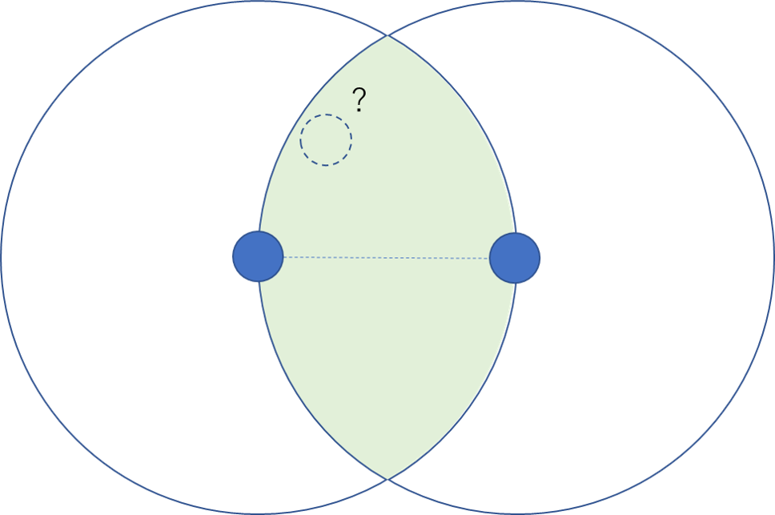

# condensedMNIST

## Abstract
MNIST trainset can be reduced from 60000 to 20953 by using a Relative Neighborhood Graph(RNG). Classification results using the trainset in DNN and kNN are no different from the all trainset and better than random sampling.

## Method
RNG is one of the neighbor graphs. It's represent adjacency between nodes as their edges. 

When creating a RNG for a dataset, take the following steps:
1. For a pair of examples, draw two hypersphere whose radius is the distance between the pairs.
2. If no other examples exist in the overlapping region of the two hyperspheres, connect a edge.

<div align="center">
    
</div>

After creation, remove the examples not connected to ones belonging to different classes. Thereby, we get the representative subset for decision boundaries. Such data reduction is called "condensing", "editing", etc.

## Results
### DNN Classification(dnn.{py, ipynb})
The test accuracy for each dataset when training DNN with 4 fully connected layers and ReLU. 

The number of epochs is 100 but the number of iterations is kept the same.

| Mode          | Number of Samples |  Test Acc[%] |
|---------------|:-----------------:|:------------:|
| All data      |       60000       |     97.8     |
| Condensed     |       20953       |     98.0     |
| Random        |       20953       |     96.7     |

### k-Nearest-Neighbor Classification(kNN.{py, ipynb})
- k=1, L2 distance

| Mode          | Number of Samples |  Test Acc[%] |
|---------------|:-----------------:|:------------:|
| All data      |       60000       |     96.3     |
| Condensed     |       20953       |     95.7     |
| Random        |       20953       |     95.0     |

Note that it is needed Pytorch for dnn.{py, ipynb} and JAX for kNN.{py, ipynb}. It is recommended to use Colab to run the codes or notebooks.

## Citation
```
@article{10027363503,
author="BHATTACHARYA, B. K.",
title="Application of proximity graphs to editing nearest neighbor decision rule",
journal="International Symposium on Information Theory, Santa Monica, 1981",
ISSN="",
publisher="",
year="1981",
month="",
volume="",
number="",
pages="",
URL="https://ci.nii.ac.jp/naid/10027363503/",
DOI="",
}
```
